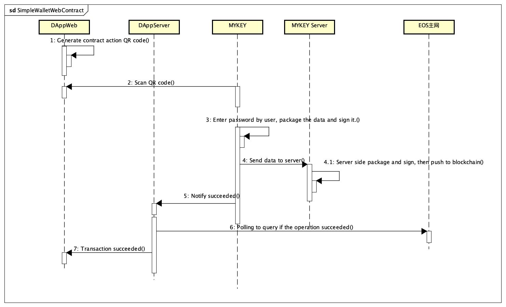

# MYKEY Development Toolkit


## Introduction

MYKEY Development Toolkit, aka MDK, a toolkit for developers to develop applications based on the MYKEY account system. It contains MYKEY Client SDK, JSBridge Lib and SimpleWallet
protocol extension. This suite of development toolkit can help applications wake up MYKEY to login, transfer, contracts invoke, sign and other on-chain operations. This tooklit only support EOS chain by now, and will extend to other public chains with the roadmap of MYKEY for multi-chain.


## MYKEY Client SDK

The MYKEY Client SDK consists of the iOS SDK, Android SDK and MYKEY Core.

MYKEY Core is implemented by GO language, and encapsulates the interaction logic of MYKEY Client App to MYKEY server and blockchain. It is provided to Android in the form of binary package via JNI mode. iOS implemented via static library, and it wasn't open sourced by now.

The Android SDK and iOS SDK can help APP developers to simplify implement to use MYKEY accounts to log in, transfer, contract, and sign up.
The SDKs also include extra contract operations for the token issued by [eos-stake-token contract] (https://github.com/mykeylab/eos-stake-token), which also includes some sample code.


### Android SDK

[code and docuemnt](./MYKEY-ANDROID-SDK-EN.md)

### iOS SDK

code and docuemnt

## JSBridge Lib

JSBridge is injected javascript code in MYKEY dapp browser enviroment by default, it support Scatter protocol, developers can develop H5 dapp follow [Scatter Document](https://get-scatter.com/docs/api-reference), it will also support web3js protocol when MYKEY support ETH.


**Special Notice:** [MYKEY account structure](https://github.com/mykeylab/Documentation/blob/master/English/MYKEY%20on%20EOSIO.md#mykey-account-structure) is different with other EOS account, if dapp verify signature in their server side, should use the public key of Reserved, more details see this [Document](https://github.com/mykeylab/Documentation/blob/master/English/MYKEY%20on%20EOSIO.md#if-dapp-dependents-on-getarbitrarysignature-or-other-server-side-authentication)


For ease of use, it provided a few extra methods, e.g. fullscreen, rotation of the sign box, close window and so on

### Enter fullscreen mode

Enter fullscreen mode, dapp can adjust the rotation of the sign box according the value of isLandscape
```
// isLandscape: Rotation of the sign box , ture as horizontal，false as vertical.
window.MyKey.Browser.openFullScreen(isLandscape)
```

### Exit fullscreen mode

In non-fullscreen mode, the rotation of the sign box always in vertical screen mode.
```
window.MyKey.Browser.closeFullScreen()
```

### Quit

Quit dapp, destory the current window
```
window.MyKey.Browser.closeWindow()
```

### Forbid Physical Back (Only in Android)

Fobid native physical back button in Android

```
window.MyKey.Browser.forbidPhysicalBack()
```

### Allow Physical Back (Only in Android)

Allow native physical back button in Android

```
window.MyKey.Browser.allowPhysicalBack()
```


## SimpleWallet Protocol Compatible

### Sample code for redirect to MYKEY

**Reminder:** In Android client, for avoid conflict with other wallets, developer can use following code to rediect to MYKEY precisely through set the MYKEY packge name: com.mykye.id

```
try {
    Intent intent = new Intent(Intent.ACTION_VIEW, Uri.parse(url));
    intent.setPackage("com.mykey.id");
    intent.setFlags(Intent.FLAG_ACTIVITY_NEW_TASK);
    context.startActivity(intent);
} catch (Exception e) {
    e.printStackTrace();
}
```

### Login and Transfer

MYKEY follows the SimpleWallet protocol implementation. See the following document for details:

[https://github.com/southex/SimpleWallet/blob/master/README_en.md](https://github.com/southex/SimpleWallet/blob/master/README_en.md)

Beside support **login** and **transfer** of SimpleWallet specification，MYKEY also additionally supports **contract** and **signature** method.

**Special Notice:** [MYKEY account structure](https://github.com/mykeylab/Documentation/blob/master/English/MYKEY%20on%20EOSIO.md#mykey-account-structure) is different with other EOS account, if dapp verify signature in their server side, should use the public key of Reserved, more details see this [Document](https://github.com/mykeylab/Documentation/blob/master/English/MYKEY%20on%20EOSIO.md#if-dapp-dependents-on-getarbitrarysignature-or-other-server-side-authentication)

### Contract

#### Sequence diagram for Web QR code scan



#### Sequence diagram for Mobile applcaiton wake up


Please pass the data to MYKEY as follows, the data format is json:

```
// Contract call data format

{
    protocol    string   // protocol name，use "SimpleWallet" by default
    version     string   // protocol version, e.g. "1.0"
    action      string   // action type, use "transaction"
    dappName    string   // DApp name
    dappIcon    string   // DApp icon url
    desc        string   // Semantic description of MYKEY display to the user contract call
    callback    string   // Deeplink MYKEY callback to DApp, e.g. custom://custom.com/contract
    notifyUrl   string   // The callback URL endpoint of DAppServer for receive success notification from MYKEY
    ContractRequest [  // Arrary of contact actions, include transfer and non-transfer actions
      { // non-transfer
    	  account   string // contract code name
    	  name      string // contract action name
    	  info      string // Semantic description of MYKEY display to the user about this action
    	  data      object // The parameter object passed according to the contract abi definition e.g. {key1: value1, key2: value2 }
      },
      { // transfer
    	  account   string //  contract code name
    	  name      string // contract action name
    	  info      string // Semantic description of MYKEY display to the user about this action
    	  TransferDataRequest {
    	    from     string // From
    	    to       string // To
    	    quantity string // Amount and Symbol，e.g. "1.0000 EOS"
    	    memo     string // Memo
    	  }
      }
    ]
    expired	    number   // 仅Web二维码模式可用，过期时间，unix时间戳
}
```


### Sign

#### Sequence diagram for Web QR code scan


#### Sequence diagram for Mobile applcaiton wake up


Please pass the data to MYKEY as follows, the data format is json:

```
// Sign call data format
{
    protocol    string   // protocol name，use "SimpleWallet" by default
    version     string   // protocol version, e.g. "1.0"
    action      string   // action type, use "sign"
    dappName    string   // DApp name
    dappIcon    string   // DApp icon url
    desc        string   // Semantic description of MYKEY display to the user contract call
    message     string   // Unsigned messages
    callback    string   // Deeplink MYKEY callback to DApp, e.g. custom://custom.com/contract
    notifyUrl   string   // The callback URL endpoint of DAppServer for receive success notification from MYKEY
    expired     number   // Only in web QR code mode, expire date,unix timestamp
}
```


## Issue Report

Please submit issue in github

## FAQ
